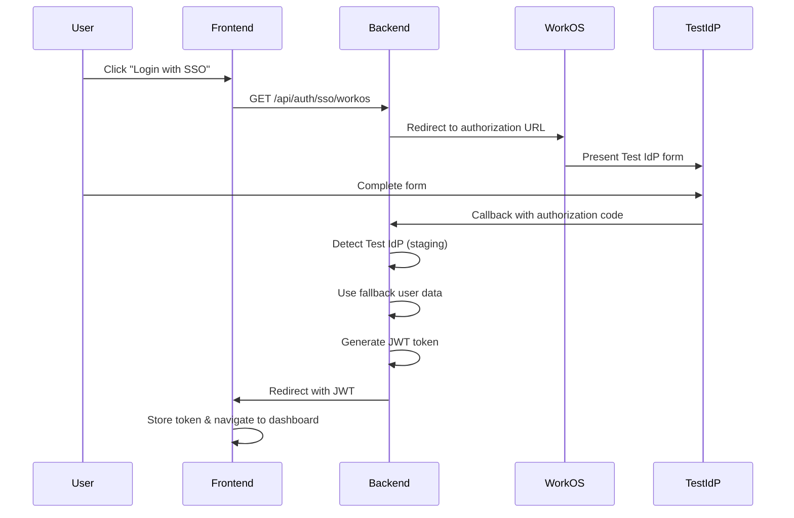

# Technical Documentation

## Architecture Overview

**Technology Stack**: Spring Boot 2.7.18 + Spring Security 5.7.11 + Angular 15  
**SSO Provider**: WorkOS AuthKit (OAuth2-style flow)  
**Authentication**: JWT tokens with comprehensive user claims  

### Authentication Flow


## Configuration

### Current Staging Setup
```yaml
# application.yml
workos:
  environment: staging
  api-key: YOUR_WORKOS_API_KEY_HERE  # Replace with your actual WorkOS API key
  client-id: client_01K11PQC0JVV2WGA8EDPBVGB52
  connection-id: conn_01K11PQBX0WQMHM1CNTQ758VSF
  
  api:
    staging-base-url: https://api.workos.dev
    production-base-url: https://api.workos.com
  
  frontend:
    base-url: http://localhost:4200
    dashboard-path: /dashboard
    login-path: /login
  
  staging:
    fallback-user:
      email: staging-fallback@example.com
      first-name: STAGING
      last-name: FALLBACK
      role: MC
      organization-name: STAGING FALLBACK ORGANIZATION
      organization-id: staging-fallback-org-001
      connection-id: staging-fallback-conn-001
```

### Environment Variables (start-backend.sh)
```bash
export WORKOS_API_KEY="YOUR_WORKOS_API_KEY_HERE"
export WORKOS_CLIENT_ID="client_01K11PQC0JVV2WGA8EDPBVGB52"
export WORKOS_BASE_URL="https://api.workos.dev"
```
## Core Components

| Component | Purpose |
|-----------|---------|
| **WorkOSConfig.java** | Environment detection, WorkOS SDK setup, Test IdP support |
| **WorkOSCallbackController.java** | OAuth callback handling, Test IdP detection, JWT generation |
| **JwtUtil.java** | Token creation/validation for internal & external users |
| **SecurityConfig.java** | Dual auth flows, JWT filters, role-based endpoints |
| **auth.service.ts** | Frontend SSO initiation & token management |
| **auth.guard.ts** | Route protection & token validation |

## API Reference

### Key Endpoints

| Method | Endpoint | Purpose |
|--------|----------|---------|
| `GET` | `/api/auth/sso/workos` | Initiate WorkOS SSO |
| `GET` | `/auth/workos/callback` | Handle OAuth callback |
| `POST` | `/api/auth/login` | Internal user login |
| `GET` | `/api/me` | Current user details |
| `GET` | `/api/demo/{user\|manager\|admin}` | Role-based test endpoints |

### Sample Responses

#### SSO Initiation
```
GET /api/auth/sso/workos
→ Redirects to: https://api.workos.dev/sso/authorize?...&organization=org_test_idp
```

#### Internal Login
```json
POST /api/auth/login {"username":"admin","password":"password"}
→ {"token":"eyJhbGciOiJIUzI1NiJ9...","user":{"username":"admin","role":"SMA"}}
```

#### User Profile
```json
GET /api/me (with JWT)
→ {
  "username": "staging-fallback@example.com",
  "role": "MC",
  "source": "workos",
  "firstName": "STAGING",
  "lastName": "FALLBACK",
  "organizationName": "STAGING FALLBACK ORGANIZATION"
}
```

## JWT Token Structure

### Internal Users
```json
{"sub":"admin","role":"SMA","source":"internal","iat":...,"exp":...}
```

### WorkOS Users (Staging Fallback)  
```json
{
  "sub": "staging-fallback@example.com",
  "role": "MC",
  "source": "workos",
  "firstName": "STAGING",
  "lastName": "FALLBACK",
  "profileId": "staging_profile_1761180699058",
  "connectionId": "staging-fallback-conn-001",
  "organizationId": "staging-fallback-org-001",
  "organizationName": "STAGING FALLBACK ORGANIZATION"
}
```

### WorkOS Users (Production)
```json
{
  "sub": "user@company.com",
  "source": "workos", 
  "firstName": "John",
  "lastName": "Doe",
  "profileId": "prof_01H1WXDM8KYNXF8RBVZ3VY9Q7N",
  "organizationName": "Acme Corporation"
}
```

## Role Mapping & Environment Behavior

### Role Assignment Logic
```java
private String determineUserRole(String email) {
    if (email.contains("admin")) return "SMA";  // Super Admin
    if (email.contains("manager")) return "MA"; // Manager  
    if (email.contains("support")) return "SU"; // Support
    return "MC"; // Member (default)
}
```

### Environment-Specific Behavior

| Environment | API Base URL | Auth Method | User Source |
|-------------|--------------|-------------|-------------|
| **Staging** | `https://api.workos.dev` | Test IdP → Fallback | Static staging user |
| **Production** | `https://api.workos.com` | Real SAML | Live WorkOS profiles |

## Production Migration

### Update Configuration
```yaml
workos:
  environment: production
  api-key: ${WORKOS_API_KEY}        # sk_live_...
  client-id: ${WORKOS_CLIENT_ID}    # client_...
  connection-id: ${WORKOS_CONNECTION_ID}  # conn_... (real SAML)
```

### Set Production Environment Variables  
```bash
export WORKOS_API_KEY="sk_live_your_production_key"
export WORKOS_CLIENT_ID="client_your_production_client"
export WORKOS_BASE_URL="https://api.workos.com"
```

## Troubleshooting

| Issue | Expected Behavior | Solution |
|-------|-------------------|----------|
| **"Unauthorized" in staging** | ✅ Normal - Test IdP codes invalid for API | Uses fallback user automatically |
| **Missing JWT in dashboard** | ❌ Auth guard issue | Check token in URL params |
| **Environment variables not set** | ❌ WorkOS SDK misconfigured | Use `./start-backend.sh` |

### Debug Logging
```yaml
logging:
  level:
    com.example.workospoc: DEBUG
    org.springframework.security: DEBUG
```

## Security Considerations

- **JWT Secret**: Environment-specific secrets
- **HTTPS**: Required for production  
- **CORS**: Configured for localhost + production domains
- **Token Expiry**: 24-hour default expiration
- **Input Validation**: OAuth parameter validation
- **Rate Limiting**: Consider implementing for auth endpoints

---

**This implementation provides a complete, production-ready WorkOS AuthKit integration** that seamlessly transitions from staging (Test IdP) to production (real SAML connections) with minimal configuration changes.
